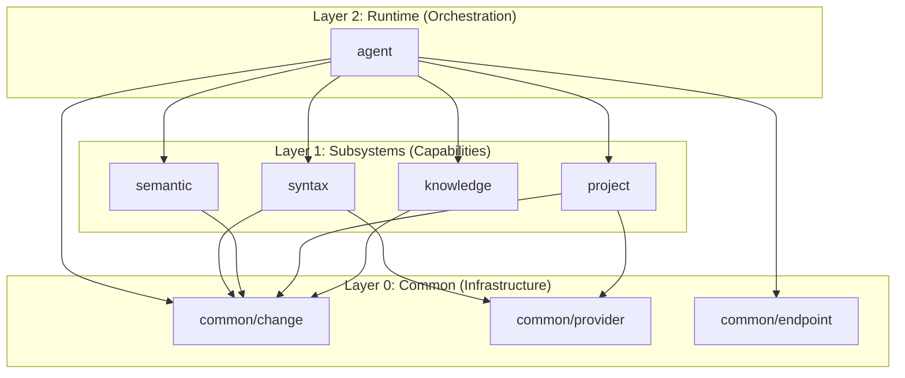

# Zhiyun Backend Architecture

本目录包含 Zhiyun IDE 的后端核心实现。Zhiyun 是一个**以更改（Change）为中心**的下一代智能 IDE，其架构设计紧紧围绕**并行化**、**语义化**、**智能化**三大核心支柱。

## 1. 三大核心支柱

### 1.1 并行化 (Parallelism)

支持多 Agent 在不同 Thread（分支）上大规模并发工作，突破传统 IDE 单光标/单线程交互的限制。

* **CRDT 底座**：利用无冲突复制数据类型，保障多分支并发编辑的最终一致性。
* **Thread 隔离**：每个 Agent 拥有独立的执行分支（Thread），互不干扰，仅在合并点处理冲突。
* **异步 I/O**：所有文件操作与工具调用均为异步，最大化利用计算资源。

### 1.2 语义化 (Semantic-First)

不再将代码视为纯文本，而是优先基于语法树与语义图进行理解与操作。

* **语义操作**：编辑原子不是“插入字符”，而是“重命名函数”、“移动类”、“提取方法”。
* **增量索引**：基于 Tree-sitter 与 Scope Graph 构建轻量级增量索引，实现毫秒级导航与补全。
* **结构化合并**：利用语义信息辅助冲突解决（例如区分“格式化冲突”与“逻辑冲突”）。

### 1.3 智能化 (Intelligence)

Agent 不仅是执行者，更是具备自主决策能力的智能体。

* **动态路由**：根据任务难度动态选择模型（如用快模型做检索，用强模型做重构）。
* **上下文自适应**：智能压缩与选择上下文，确保有限窗口内包含最关键信息。
* **RAG 增强**：结合向量检索与知识图谱，为 Agent 提供精准的项目知识与领域上下文。

## 2. 核心架构原则

Zhiyun 的架构设计基于以下技术原则：

| 核心组件 | 技术定位 | 职责描述 |
| :--- | :--- | :--- |
| **CRDT / Change** | **数据一致性层** | 定义数据的最终一致性模型、版本控制、分支（Thread）管理、操作回放与合并规则。 |
| **Agent** | **运行时与调度层** | 负责任务执行、资源调度、上下文管理、子 Agent 派生 (fork) 以及合并策略的制定。 |
| **Subsystems** | **能力层** | `syntax`, `semantic`, `project`, `knowledge` 等模块提供结构化的工具能力（如解析、索引、构建），供 Agent 调用。 |
| **Provider** | **I/O 适配层** | 负责将抽象的 Change 应用到具体的 I/O 后端（本地磁盘、远程 SSH、容器文件系统等）。 |
| **Endpoint** | **通信适配层** | 封装 LLM API 的连接与基础通信，提供统一的模型调用接口。 |

---

## 3. 模块分层与依赖关系

为了保证系统的可维护性与逻辑清晰，我们严格遵循以下分层与依赖原则：

### 依赖原则

1. **向下依赖**：上层模块可依赖下层模块，反之禁止。
2. **同层独立**：Subsystems 层模块之间应尽量解耦，通过 Common 层的数据结构交互。
3. **Endpoint 独立性**：`common/endpoint` 仅负责 LLM 通信，不依赖 Agent 层的复杂逻辑。

---

## 4. 详细模块职责

### 4.1 Layer 0: Common (基础设施)

#### `common/change`

系统的核心数据层。定义了所有对工作区修改的通用数据模型。

* **ChangeSet**: 最小的版本化单元，包含一组原子操作（Operations）、父节点哈希（Parents）、作者与时间戳。
* **CRDT Core**: 实现因果一致性算法（如 RGA/Logoot），处理文本并发编辑冲突。
* **Thread Graph**: 管理 ChangeSet 构成的有向无环图（DAG），提供 LCA（最近公共祖先）计算、分支（Branch）与合并（Merge）算法。
* **Semantic Ops**: 定义高级语义操作（如 `RenameSymbol`, `MoveFunction`），并提供将其编译为底层 CRDT Ops 的接口。

#### `common/provider`

I/O 抽象层。

* **FileSystem Trait**: 定义文件读写、遍历接口。
* **Apply Interface**: 核心写入接口不是 `write_file`，而是 `apply_change(ChangeSet)`。
* **Implementations**: Local FS, Remote (SSH/gRPC), In-Memory (Testing).

#### `common/endpoint`

LLM 连接适配器。

* **LLM Client**: 统一不同模型供应商（OpenAI, Anthropic, Local models）的接口。
* **Resilience**: 处理鉴权、重试、速率限制（Rate Limiting）和基础可观测性。

### 4.2 Layer 1: Subsystems (能力子系统)

这些模块是 Agent 可调用的“工具箱”，提供结构化、可审计的输出。

#### `backend/syntax` (语法引擎)

* **Tree-sitter 集成**: 提供多语言的增量解析能力。
* **CST Access**: 提供统一的 Concrete Syntax Tree 访问接口。
* **Lightweight Indexing**: 提取基础符号表（Symbol names, types）。

#### `backend/semantic` (语义引擎)

* **Scope Graph**: 构建作用域与名称解析图（基于 stack-graph 或类似技术）。
* **Semantic Index**: 维护跨文件的符号引用与定义关系。
* **Change Compiler**: 将语义意图（"Rename X to Y"）编译为具体的 CRDT ChangeSet。

#### `backend/project` (工程管理)

* **Tool Wrappers**: 封装构建工具（Cargo, Maven, NPM）、测试运行器、Linter。
* **Dependency Management**: 结构化的依赖安装、升级与锁定操作。
* **Compiler Service**: 对接 LSP 或编译器 API，获取权威的 AST 和类型信息（作为权威校验来源）。

#### `backend/knowledge` (知识增强)

* **RAG Pipeline**:
  * **Retrieval**: 向量检索（相似代码/文档）+ 图谱检索（引用链/依赖关系）。
  * **Ranking**: 基于上下文相关度重排结果。
* **Storage**: 封装向量数据库与知识图谱数据库接口。

### 4.3 Layer 2: Runtime (编排与运行时)

#### `backend/agent`

系统的核心调度运行时。

* **Agent Process**:
  * 维护 **Context**（任务目标、对话历史、检索到的知识）。
  * 持有 **Thread Handle**（指向 Change Graph 中的某个 HEAD）。
  * **Fork 机制**：能够复制自身，创建子 Agent，子 Agent 继承父 Context 和 Thread 视图（Copy-on-Write）。
* **Intelligence Modules**:
  * **Router**: 决定将 Prompt 发送给哪个模型（快模型 vs 强模型）。
  * **Compressor**: 智能压缩 Context，保留关键信息以适应 Context Window。
  * **Tool Selector**: 根据当前任务动态规划可用工具集。
* **Orchestrator**:
  * 执行 ReAct 循环或规划执行循环。
  * 管理主线（Master Thread）与分支（Feature Threads）的生命周期。
  * 执行自动合并策略或发起人工审核请求。

---

## 5. 关键工作流 (Key Workflows)

### 5.1 用户主线编辑 (The "Master" Thread)

1. **Input**: 用户在编辑器中操作（如重命名变量）。
2. **Processing**: 编辑器前端生成 **Semantic Operation**。
3. **Compilation**: `semantic` 模块将其编译为底层 **CRDT Operations** 并打包为 **ChangeSet**。
4. **Storage**: ChangeSet 存入 `common/change` 的 Store，更新 Master Thread 的 HEAD。
5. **IO**: ChangeSet 被 `apply` 到 `common/provider`，更新磁盘文件。
6. **Index**: `syntax` / `semantic` 接收变更通知，增量更新索引。

### 5.2 Agent 任务执行 (The "Fork & Merge" Flow)

1. **Trigger**: 用户指派任务（"Refactor auth module"）。
2. **Fork**: 主 Agent 从当前 Master HEAD **fork** 出一个新的 Feature Thread。
3. **Plan**: Agent 分析任务，检索 Knowledge，规划步骤。
4. **Action**:
    * 调用 `syntax` 分析代码结构。
    * 调用 `project` 运行测试确认现状。
    * 生成修改提案（**Change Proposal**）。
5. **Execution**: 修改提案作为 ChangeSet 写入 Feature Thread。
6. **Verify**: Agent 调用 `project` 在 Feature Thread 上运行测试（Sandbox 环境）。
7. **Merge**:
    * 测试通过 -> 尝试 **Auto-Merge** 到 Master。
    * 有冲突/高风险 -> 提交 **Review Request**，由用户人工审核（Semantic Diff）。

### 5.3 权威 AST 回退 (The "Ground Truth" Check)

当 `semantic` 的轻量索引不足以确认复杂类型（如 C++ 模板、Rust 宏）时：

1. Agent 标记当前分析置信度低。
2. 触发 `project` 模块调用真实编译器/LSP。
3. 获取权威诊断或 AST 信息。
4. 将权威信息回填到 `semantic` 索引或用于修正 Agent 的理解。

---

## 6. 系统约束

为了保证系统的稳定性与可审计性，我们施加以下强制约束：

1. **No Raw Edits**: Agent **绝对禁止**直接调用 `fs.write()` 修改源文件。所有修改必须体现为 ChangeSet。
2. **No Raw Shell**: Agent **绝对禁止**执行 `exec("rm -rf /")` 等任意 Shell 命令。所有外部命令必须通过 `project` 模块中定义好 Schema 的结构化工具执行。
3. **Audit Trail**: 所有的 ChangeSet 必须包含 Author 信息（Agent ID 或 User ID）与生成原因（Task ID）。

---

## 7. 开发里程碑

* **Phase 1: Foundation**
  * 实现 `common/change` (CRDT) 与 `common/provider`。
  * 实现基础的 Apply/Replay 机制。
* **Phase 2: Structured Tooling**
  * 实现 `syntax` (Tree-sitter) 与 `semantic` 基础索引。
  * 打通 Semantic Op -> CRDT Op 编译链路。
* **Phase 3: Agent Runtime**
  * 实现 Agent Loop, Context Management, Tool Use。
  * 实现 Thread Fork/Merge 逻辑。
* **Phase 4: Intelligence & RAG**
  * 集成 `knowledge` (Vector/Graph DB)。
  * 实现智能路由与上下文压缩。
